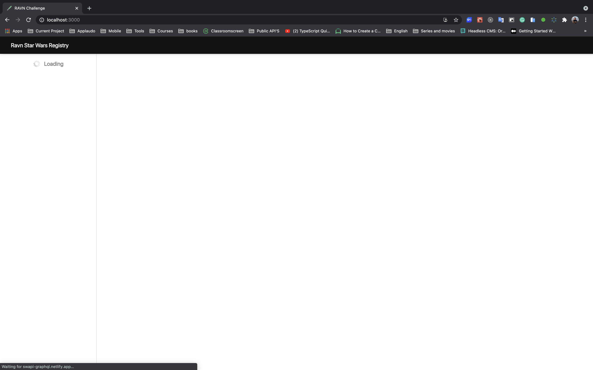
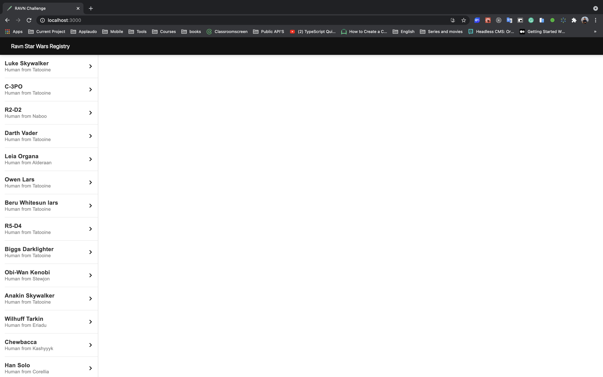
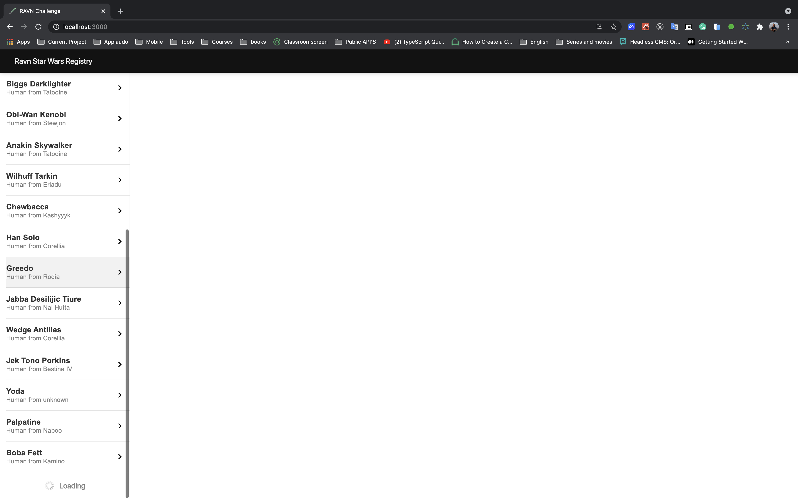
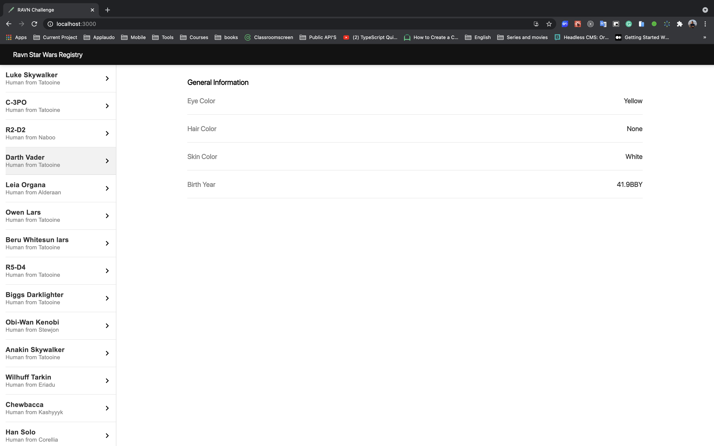
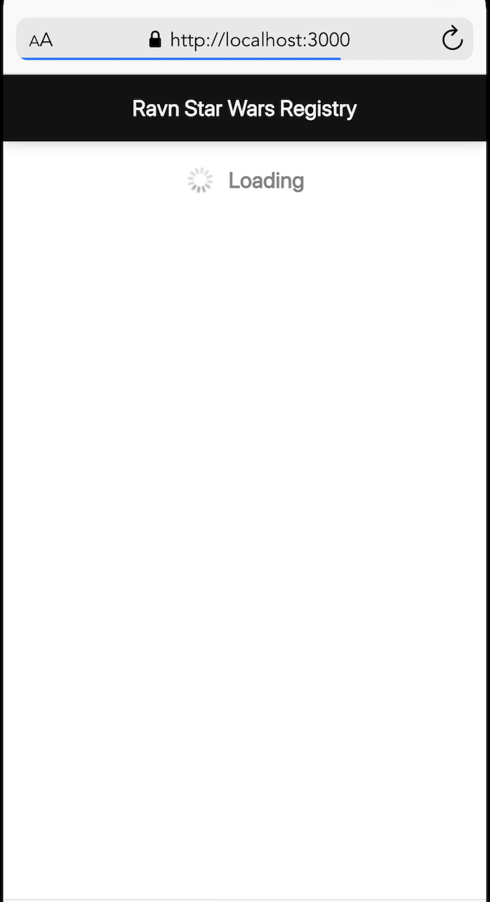
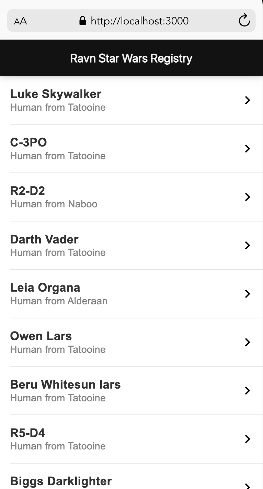
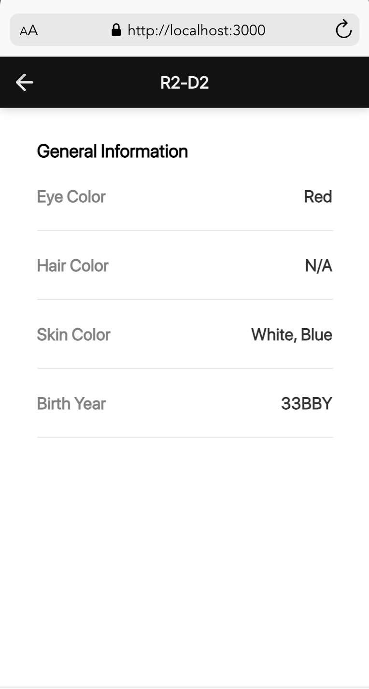

# RAVN CHALLENGE V2 CARLOS PEREZ
Web app that allows you to browse the Star Wars characters and show their personal infomation

## Live Demo
[**RAVN CHALLENGE V2 CARLOS PEREZ**](https://ravn-challenge-v2-carlos-perez.netlify.app/)

## Screenshots

## Installation and Setup Instructions
Clone down this repository. You will need `node (v.14.15.5)` and `yarn (v.1.22.5)` installed globally on your machine.

Installation:
`yarn install`

To Start Server:
`yarn dev`

To Visit App:
`localhost:3000`
  
## Author
-   [**Carlos Perez**](https://github.com/CPrz21)  - FrontEnd Dev ⭐️